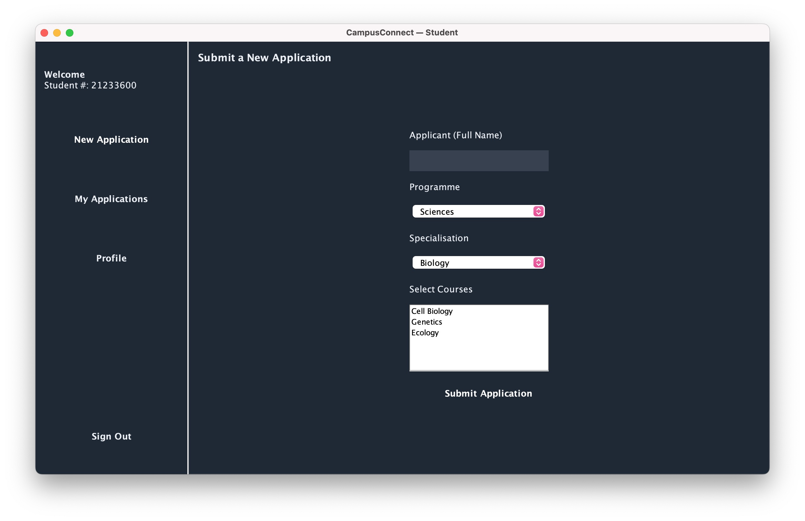
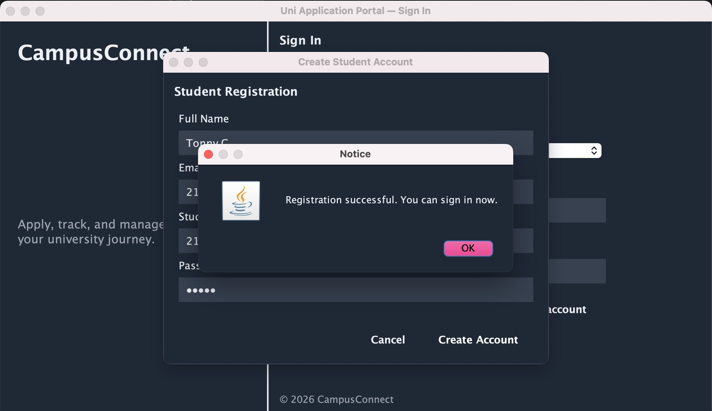

# Student Management System

## Project Overview
This project is a Java based Student Management System that uses MySQL as the database and JDBC for connectivity. The system allows users to manage student records efficiently through a simple application.

---

##  Tools Used
- Java (OOP)  
- MySQL  
- JDBC  

---

##  Features
- Add new student records  
- View student information  
- Update existing student details  
- Delete student records  

---

##  System Functionality
- Connected Java application to MySQL database using JDBC  
- Implemented CRUD operations (Create, Read, Update, Delete)  
- Designed relational database tables to store student data  
- Ensured data consistency and efficient data handling  

---

##  Screenshots

---

##  Outcome
This project enhanced my understanding of database integration, backend development and object-oriented programming. It also strengthened my ability to build functional systems that interact with databases.

---

## 👩‍💻 Author
Lerato Letsoele
